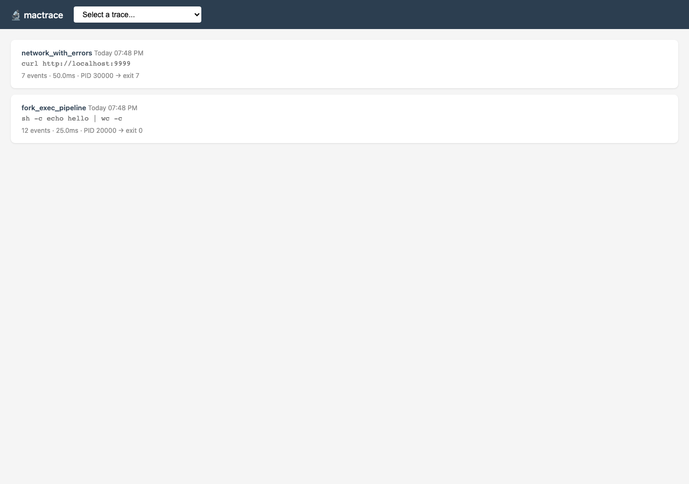
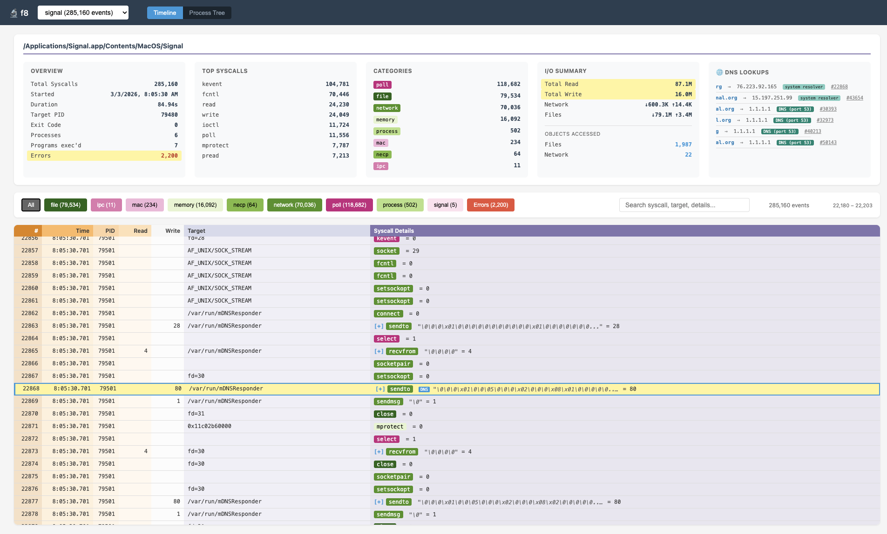

# f8 — fait accompli

*fait accompli* (n.) — a thing that has already happened or been decided, leaving us with no option but to accept.

You run a program, trace it, it does what it does, and then... what just happened?

f8 is an effort to instrument the shadows. All the details, including syscalls, files touched, network connections, all the bytes read and written. The deed is done; you're just reviewing the evidence.

**f8** is an strace-like system call tracer for macOS that uses DTrace under the hood. It traces syscalls for a given command and provides an interactive web-based timeline/exec viewer along with JSON files for analysis.


*Trace list — imported traces grouped by date with command, event count, duration, and exit code.*


*Timeline detail — DNS-enriched view of Signal's mDNSResponder lookups, with category filtering and per-event I/O capture.*

> Important: ** f8 requires SIP DTrace restrictions to be disabled. ** This is Apple, don't look at me. Check to see if its enabled/disabled with `csrutil status`. See [Troubleshooting](#troubleshooting) if you need to check/change your settings.

## Background, thanks

While doing work for DARPA's now-defunct Cyber Fast Track program I came up with the idea for f8, but Dtrace was/is so atrociously documented and supported by Apple (at least, that's my story!) along with some other technical challenges that I never got it to the point where I thought it'd be worthwhile to publically release it. This is a rewrite of that old project.

To be sure, Dtrace was/is amazing, but Apple only seems to begrudgingly accept it. eBPF is the obvious next thing, but presumably will never see the light of Mac anytime. So this.

And to be clear: I leaned so much on the amazing [OpenClaw](https://openclaw.ai/) and [Claude Code](https://code.claude.com/docs/en/overview) to create this that they squealed in pain. I'll take responsibility for all the flaws, but they did the real work.

## Installation

### Prerequisites

Important - I'm down to a single mac, so only tested on Sequoia. Who knows if it'll keel over or produce useless output elsewhere.

- macOS (tested on 15.3 Sequoia)
- Python 3.8+
- Node.js 18+ (for the web server)
- Root privileges (DTrace requires sudo)
- SIP dtrace restrictions disabled (see [Troubleshooting](#troubleshooting))
- Disk & RAM. It's a hog, plain and simple. Gigs of data can trivially be generated.

It uses sqlite3 to store data.

### Setup

```bash
# Clone or copy to your preferred location
git clone git@github.com:zenfish/f8.git f8
cd f8

# Run the installer (installs deps, creates config, sets up PATH)
./install.sh
```

The installer does three things:
1. **`npm install`** in `server/` — installs better-sqlite3 for the web server
2. **Creates `~/.f8/config`** — sets `F8_OUTPUT=~/traces` so traces have a consistent home. All tools read this config automatically, even through `sudo` (uses `SUDO_USER` to find your home directory). See [ENVIRONMENT.md](docs/ENVIRONMENT.md) for full config syntax.
3. **Adds tools to PATH** — creates symlinks in /usr/local/bin so you can run f8, f8_server, etc. from anywhere. If /usr/local/bin isn't writable (common without sudo), it prints the export PATH=... line to add to your shell startup file (e.g. $HOME/.bash_profile, $HOME/.zshrc, etc) instead.

### Manual Setup (if you prefer)

```bash
cd server && npm install && cd ..          # Node.js deps
mkdir -p ~/.f8 ~/traces                    # Directories
echo 'F8_OUTPUT=~/traces' > ~/.f8/config   # Config
export PATH="$PWD:$PATH"                   # PATH
```

### Verify Installation

```bash
# Should print usage info
sudo f8 --help

# Quick test — trace the 'echo' command
sudo f8 -o test.json -jp echo hello
```


### Try Without Tracing

Want to see the web UI before disabling SIP? Import the included example trace:

```bash
f8_import examples/echo-hello.json
f8_server
# go to "http://localhost:3000" in your browser
```

## Quick Start

> **New to f8?** See [TUTORIAL.md](TUTORIAL.md) for a guided walkthrough using `f8_run_all.sh` and `f8_open`.

### 1. Trace a command

```bash
sudo f8 -o trace.json -jp ls -la /tmp
```

This runs `ls -la /tmp` under DTrace, captures every syscall (open, read, write, stat, etc.), and writes structured JSON to `trace.json`. The `-j` flag enables JSON output, `-p` pretty-prints it.

### 2. Analyze the trace (text summary)

```bash
./f8_analyze trace.json
```

Sample output:
```
=== f8 Analysis ===
Command: ls -la /tmp
Duration: 12.3ms
Total syscalls: 87
PIDs traced: 1

--- Category Breakdown ---
  file      : 52  (59.8%)
  memory    : 18  (20.7%)
  process   :  9  (10.3%)
  other     :  8  ( 9.2%)

--- Top Syscalls ---
  stat64          : 15
  open            : 12
  read            :  9
  close           :  8
  mmap            :  7

--- Files Accessed ---
  /tmp                          R
  /usr/lib/dyld                 R
  /dev/dtracehelper             RS

--- Errors ---
  stat64("/tmp/.X11-unix")      ENOENT (2)
```

### 3. View in the web timeline

```bash
# Import into the database
f8_import trace.json

# Start the server
f8_server
# → http://localhost:3000
```

Select a trace from the dropdown to see the interactive timeline with:
- Color-coded syscall categories (file, network, process, memory, IPC, signal)
- Click-to-expand I/O hexdump viewer
- Category filter buttons and text search
- Process tree visualization
- Per-syscall timing and return values

### 4. Trace everything a program does

```bash
# Capture I/O data (read/write buffer contents)
sudo f8 --capture-io -o trace.json ./my_program

# Attach to a running process
sudo f8 -p 12345 -o trace.json -t 30

# Trace with larger buffers for busy programs
sudo f8 --capture-io --strsize 65536 -o trace.json ./my_program
```

## Requirements

- macOS (tested on 15.3 Sequoia)
- SIP disabled (or at least dtrace restrictions disabled) for full tracing
- Python 3.8+
- Root privileges (DTrace requires sudo)


## Tools

| Tool | What it does |
|------|-------------|
| `f8` | Core tracer — runs a command under DTrace, captures syscalls to JSON |
| `f8_run_all.sh` | **One-shot pipeline:** trace → analyze → import → serve |
| `f8_server` | Start the web-based timeline viewer |
| `f8_open` | Trace macOS .app bundles (Steam, Safari, etc.) |
| `f8_analyze` | CLI text analysis — syscall breakdown, files, errors, I/O extraction |
| `f8_timeline` | Generate a standalone HTML timeline (no server needed) |
| `f8_data` | Manage traces — list, info, delete, vacuum, stats |
| `f8_import` | Import JSON traces into SQLite for the web server |

## Troubleshooting

### "dtrace: system integrity protection is on, some features will not be available"

DTrace on modern macOS is restricted by SIP. To get full tracing:

1. Reboot into Recovery Mode (hold Cmd+R on Intel, power button on Apple Silicon)
2. Open Terminal from Utilities menu
3. Run: `csrutil enable --without dtrace`
4. Reboot

**Note:** This only disables SIP's dtrace restrictions, not SIP itself. To re-enable: `csrutil enable` from Recovery Mode.

### "dtrace: failed to initialize dtrace: DTrace requires additional privileges"

DTrace requires root. Always run f8 with `sudo`:
```bash
sudo f8 -o trace.json ./my_program
```

### Drops: "dtrace: N dynamic variable drops" or missing events

DTrace has fixed-size buffers. If your traced program is very busy, increase buffer sizes:
```bash
sudo f8 --bufsize 512m --dynvarsize 512m -o trace.json ./my_program
```

For I/O capture, also increase string/data sizes:
```bash
sudo f8 --capture-io --strsize 65536 --io-size 65536 -o trace.json ./my_program
```

### Server won't start / "Cannot find module 'better-sqlite3'"

Install Node.js dependencies:
```bash
cd server && npm install
```

### Tracing macOS .app bundles (Steam, Safari, etc.)

Running `f8 open /Applications/Steam.app` only traces the `open` command itself — not Steam. The `open` command is a thin launcher that asks macOS Launch Services to start the app, then exits. f8 traces `open`, which finishes in a few seconds, while Steam continues running as a completely separate process.

**Use `f8_open` instead:**

```bash
# See what binary the app actually runs:
f8_open --list /Applications/Steam.app

# Trace it:
f8_open /Applications/Steam.app

# Full pipeline (trace + analyze + import + server):
f8_open --run-all /Applications/Steam.app

# Pass flags to the app:
f8_open /Applications/Steam.app -- --no-browser
```

`f8_open` reads the app's `Info.plist` to find the real executable (`CFBundleExecutable`), then runs f8 against that binary directly.

**Note:** Some apps spawn additional helper processes after launch. f8 traces the main process and its direct children, but helpers launched via XPC or Launch Services won't be captured.

### Empty or missing trace output

- Check that the traced program actually ran (look for exit code in the JSON)
- Try `-v` (verbose) to see DTrace activity on stderr
- Use `-e` to detect untraced syscalls that f8 doesn't cover yet
- Some programs behave differently under sudo — use `-u yourname` to run as yourself

### Import shows "0 events imported"

The JSON file might be empty or malformed. Check it:
```bash
python3 -c "import json; d=json.load(open('trace.json')); print(f'{len(d.get(\"events\",[]))} events')"
```

## Adding Syscalls

See **[ADDING_SYSCALLS.md](docs/ADDING_SYSCALLS.md)** for a step-by-step guide to adding new system calls. There are two levels:

- **Level 1 (basic):** Add one line to `syscalls.json` — the syscall gets counted, categorized, and colored in all tools. Takes 30 seconds.
- **Level 2 (rich):** Add DTrace probes + a Python parser to capture and decode arguments (paths, fds, flags). Takes 15-30 minutes.


## Future Improvements

- [ ] Socket address decoding (IP/port extraction)
- [ ] More granular timestamps per syscall
- [ ] Output filtering options (file-only, network-only, etc.)
- [x] Timeline visualization tool (f8_timeline)
- [x] Data content capture for read/write (`--capture-io`)
- [x] Web-based timeline server with hexdump viewer


## Documentation

| Document | Contents |
|----------|----------|
| [TUTORIAL.md](TUTORIAL.md) | Guided walkthrough with `f8_run_all.sh` |
| [DNS analysis](docs/DNS.md) | How f8 detects and classifies DNS resolution paths. |
| [docs/usage.md](docs/usage.md) | Full CLI usage, environment variables, path resolution |
| [docs/output-format.md](docs/output-format.md) | JSON output schema, process tracking, traced syscalls |
| [docs/io-capture.md](docs/io-capture.md) | I/O data capture, vectored I/O (`--iovec`), DIF budget |
| [docs/analysis.md](docs/analysis.md) | Analysis tools, timeline server, jq recipes |
| [docs/testing.md](docs/testing.md) | Test suite structure, running tests, coverage |
| [API.md](docs/API.md) | Server REST API reference — all endpoints, params, and response schemas |
| [ENVIRONMENT.md](docs/ENVIRONMENT.md) | Config file syntax, `~`/`$VAR` expansion, `SUDO_USER` handling |
| [ADDING_SYSCALLS.md](docs/ADDING_SYSCALLS.md) | Step-by-step guide to adding new syscall handlers |
| [COVERAGE.md](docs/COVERAGE.md) | Syscall coverage breakdown by category and macOS version |
| [DNS.md](docs/DNS.md) | How f8 detects and classifies DNS resolution paths |

